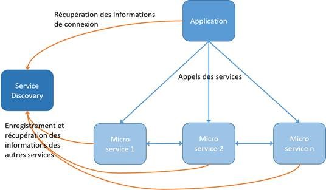

# Défi Genapi groupe Septeo : Sous la robe des LegalTech

## Thèmes
LegalTech, Micro services

## Défi
Le monde des LegalTech (utilisation des technos et logiciels pour offrir des services juridiques) impose souvent une maîtrise complète et sécurisée des données reparties sur plusieurs sites.

Nous vous proposons un aperçu de notre quotidien en implémentant votre solution en architecture microservices sur une stack multi-technos.
Dans votre solution pour le sujet principal de la Nuit de l'Info, faites dialoguer un minimum de 2 composants qui ne doivent pouvoir se connaître que par leur annuaire (service discovery).

Ceux deux (ou plus !) composants et annuaires doivent être implémentés dans des technologies différentes (C#, Js/Ts et autre), mais doivent communiquer de manière la plus transparente possible pour l'utilisateur. 
N’hésitez pas à utiliser VsCode et ses nombreuses extensions.

## Dépot

Plusieurs possibilités :
- Effectuez une Pull Request sur ce GitHub avec vos sources ou un README expliquant comment accéder à votre projet
- Effectuez un Fork du dépôt et poussez vos sources ou un README expliquant comment accéder à votre projet

Dans tous les cas incluez un README ou une documentation permettant la compréhension de votre solution